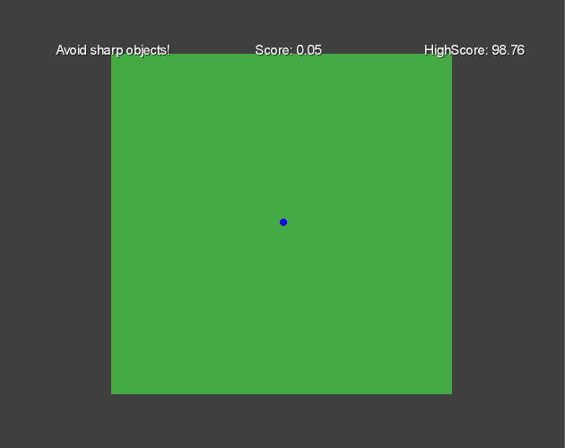

  

## Play

Game page on itch.io: https://guibdbello.itch.io/shapezoid

  

## About

Control a sphere to avoid geometric 'evil' objects.

In a world of harmony, where every object has at least a vertex, a Sphere is born. All objects became instantly afraid of the Sphere, for it has no vertex. They see the Sphere as a threat, and repudiate the poor Sphere, hunting it to death.

### Game Jam

Game made for the Game Jam **Game Off 2018** between 1st of November and 1st of December.

Theme: **HYBRID**.

## Setup

**Obs.:** This setup is ready for *Windows* operational systems.

### Installation

1. Clone repository: `git clone https://github.com/GuiBDBello/Shapezoid.git`.
2. Open the project in Eclipse: `File > Import... > Gradle > Existing Gradle Project`.

### Development

#### Eclipse

1. `Right click your desktop project > Run as > Run Configurations...`.
2. Select `Java Application` and in the top left, click the icon `New launch configuration`.
3. As `Main class` select `DesktopLauncher.java`.
4. Customize the code as you want in `Shapezoid-core/src` and `Shapezoid-desktop/src`.
5. Run your new configuration.

### Build

**Obs.:** This project is not built for *Android* nor *iOS*, only for *Windows*.

- Open the `Command Prompt` (`Ctrl + R`, type `cmd` and press `Enter`).
- Navigate to the project folder.
- Execute the command `gradlew desktop:dist`. Inside the `desktop` folder will be generated the folder `build`.
- On `build/libs/`, double-click `desktop-1.0.jar`.
- Enjoy!
