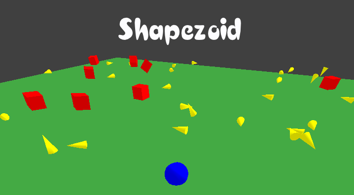

  

  Control a sphere to avoid geometric 'evil' objects.
   
   
  <a href="https://guibdbello.itch.io/shapezoid">Download Game</a>
  ·
  <a href="https://github.com/GuiBDBello/Shapezoid/issues/new?labels=bug&template=bug-report---.md">Report Bug</a>
  ·
  <a href="https://github.com/GuiBDBello/Shapezoid/issues/new?labels=enhancement&template=feature-request---.md">Request Feature</a>

## Table of Contents

<ol>
  <li><a href="#introduction">Introduction</a></li>
  <li><a href="#getting-started">Getting Started</a></li>
  <li><a href="#build-process">Build Process</a></li>
  <li><a href="#acknowledgments">Acknowledgments</a></li>
  <li><a href="#license">License</a></li>
</ol>

## Introduction

In a world of harmony, where every object has at least a vertex, a Sphere is born. All objects became instantly afraid of the Sphere, for it has no vertex. They see the Sphere as a threat, and repudiate the poor Sphere, hunting it to death.

  

### How to Play

- Use the arrow keys to move the player.
- Press `R` to restart the game.

### Game Jam

This game was made for the game jam [Game Off 2018](https://itch.io/jam/game-off-2018), which took place between 1st of November and 1st of December of 2018.

The theme of the Jam was: **HYBRID**.

(<a href="#readme-top">back to top</a>)

## Getting Started

To get a local copy up and running follow the steps below.

### Prerequisites

1. Install [Java JDK](https://www.oracle.com/java/technologies/downloads/).
1. Setup [Java Development Environment](https://www.freecodecamp.org/news/how-to-set-up-java-development-environment-a-comprehensive-guide/).
1. Install [Eclipse IDE](https://www.eclipse.org/downloads/packages/).
1. Clone repository: `git clone https://github.com/GuiBDBello/Shapezoid.git`.

### Configuration

1. Open the project in Eclipse: `File > Import... > Gradle > Existing Gradle Project`.
1. Customize the code as you want in `Shapezoid-core/src` and `Shapezoid-desktop/src`.
1. `Right click your desktop project > Run as > Run Configurations...`.
1. Select `Java Application` and in the top left, click the icon `New launch configuration`.
1. As `Main class` select `DesktopLauncher.java`.
1. Run your new configuration.

(<a href="#readme-top">back to top</a>)

## Build Process

1. Open the Command Prompt (`Ctrl + R`, type `cmd` and press Enter).
1. Navigate to the project folder.
1. Execute the command `gradlew desktop:dist`. Inside the desktop folder will be generated the folder "build".
1. On `build/libs/`, a file will be generated, named `desktop-1.0.jar`. You can rename the file and share with others.

(<a href="#readme-top">back to top</a>)

## Acknowledgments

List of references that were useful in the making of this project:

* [Eclipse](https://www.eclipse.org/)
* [LibGDX](https://libgdx.com/wiki/)
* [Bullet Physics](https://libgdx.com/wiki/extensions/physics/bullet/bullet-physics)

### Assets

| Name | Type | Creator | Source |
| --- | --- | --- | --- |
| Main Theme.mp3 | SFX | [Cnupoc](https://freesound.org/people/Cnupoc/) | [Freesound](https://freesound.org/people/Cnupoc/sounds/449640/) |

(<a href="#readme-top">back to top</a>)

## License

Distributed under the MIT License. See [LICENSE](LICENSE) for more information.

(<a href="#readme-top">back to top</a>)

